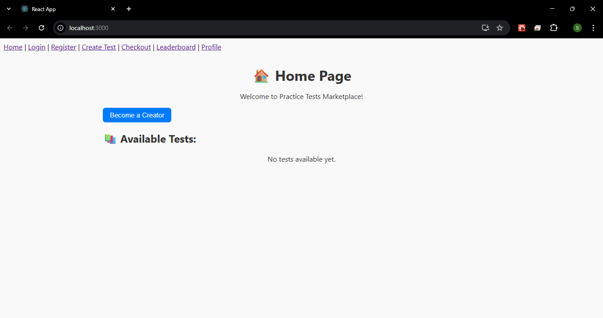
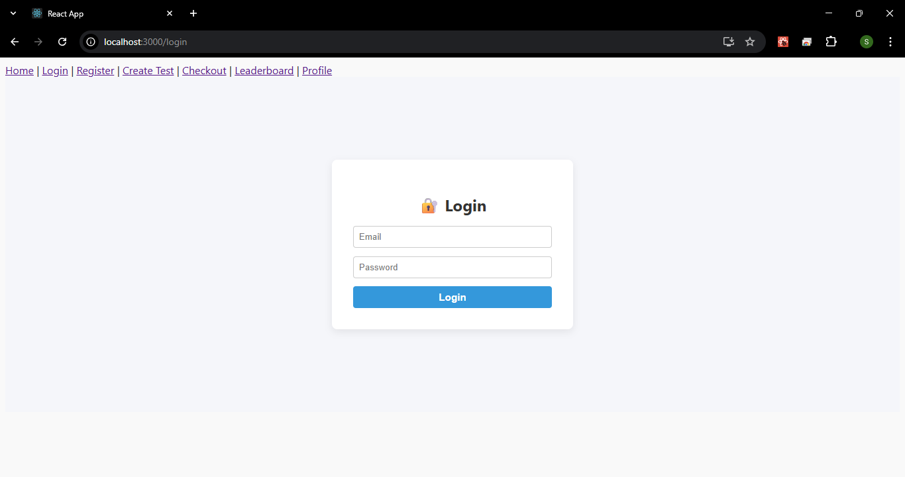
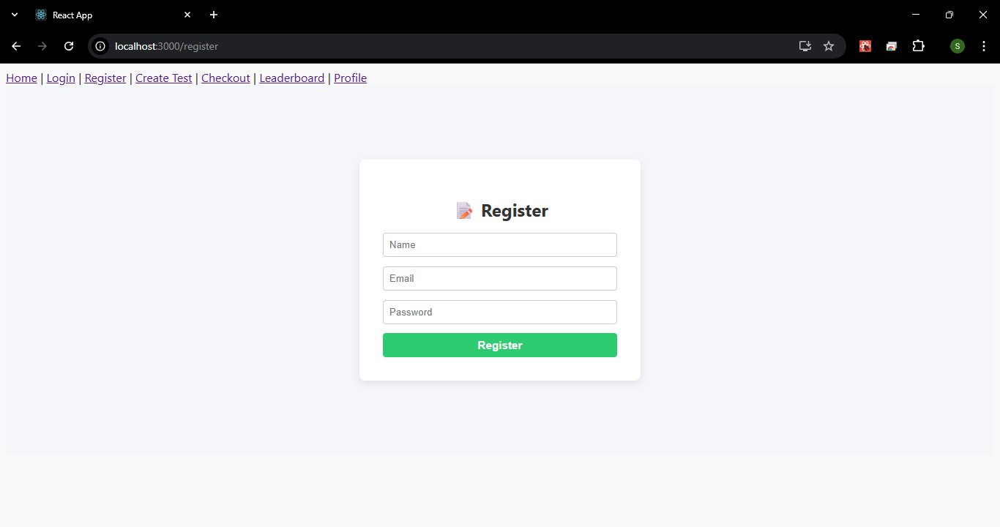
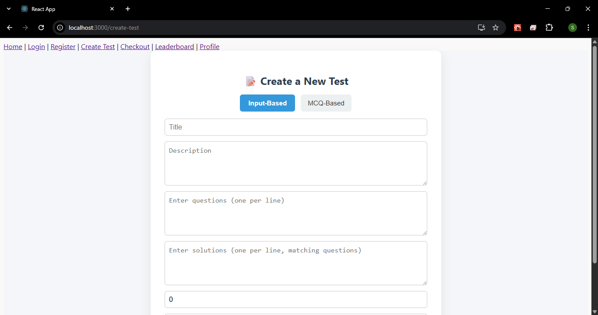
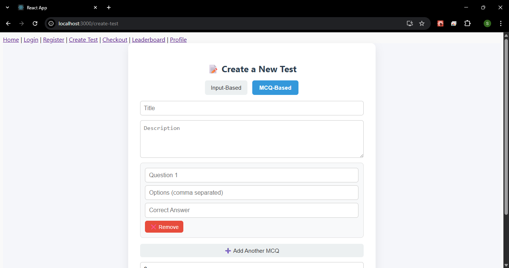
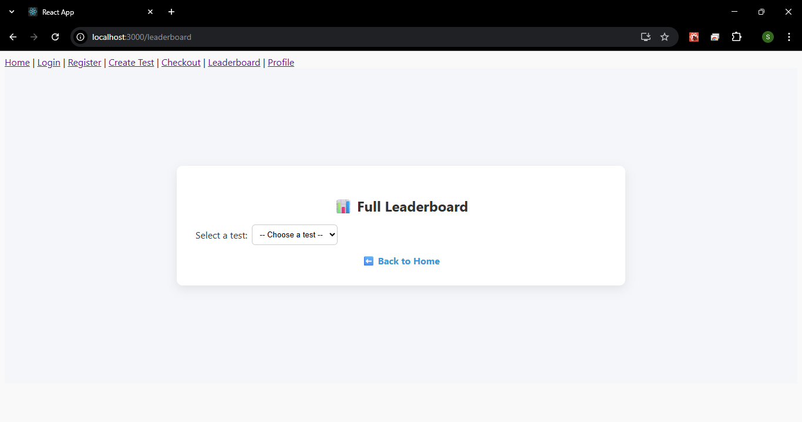
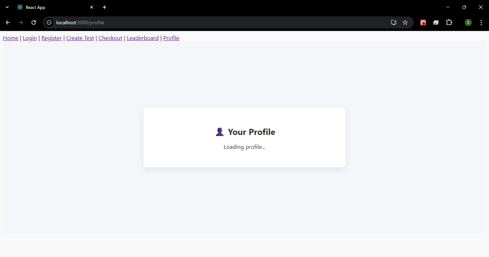

# TestlyHub

## Table of contents
- [Overview](#overview)
  - [The challenge](#the-challenge)
  - [Features](#Features)
  - [Screenshot](#screenshot)
  - [Links](#links)
  - [Built with](#built-with)
- [Author](#author)

## Overview
TestlyHub is a clean, modern marketplace for MCQ practice tests, allowing users to attempt free and paid quizzes, track progress, and view leaderboards to enhance their preparation journey.

### The challenge
- Build a scalable, clean, and fast frontend with React and Vite.
- Integrate API routes for test attempts, leaderboards, and authentication.
- Ensure mobile responsiveness and minimal UI friction for seamless test-taking.

## Features
- User Registration & Login
- JWT token-based authentication with localStorage persistence
- Profile with test attempts and leaderboard view
- Browse and take practice tests (MCQ & text-based)
- Timer-based quizzes with auto-submit and reattempt
- Purchase and creator mode toggling
- Dynamic forms for creating tests
- Leaderboard with test filtering

### Screenshot

### Links
- [Live Site](https://testlyhub-frontend.vercel.app/)
- [GitHub Repository](https://github.com/shrikanth-dev/testlyhub-frontend)
- [Back-end GitHub Repository](https://github.com/shrikanth-dev/testlyhub-backend)

### Built with
- React
- React Router DOM
- Axios
- Custom CSS Modules
- React Hooks (useState, useEffect, useRef, useCallback)
- localStorage for JWT token persistence

## Author
- **UserName:** Shrikanth Dev
- [GitHub](https://github.com/shrikanth-dev)
- LinkedIn - [@G Srikanth](https://www.linkedin.com/in/g-srikanth-gs)
